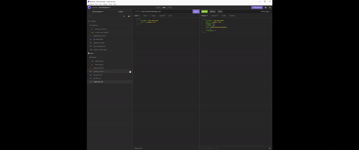

# Social Media Backend 


## Description

A simple social media backend for adding, deleting, and updating users, thoughts and reactions.

## Table of Contents

* [Installation](#installation) 
* [Usage](#usage) 
* [License](#license) 


## Installation
To install necessary dependencies, run the following command:
  ```
  npm i
  ```

## Usage

Once cloned you will want to update credentials for mongoDb. Once connected to your collection you can run the application npx nodemon index in the terminal.



## Features

Built with Express, MongoDb and Mongoose. Npm package moment handles date conversion. You may use nodemon to autorefresh the server or run the server with node index.


## License
License that explains which license the application is covered under:
This project is licensed under the GNUGPLv3 -lets people do almost anything they want with your project, except distributing closed source versions license.

## Credits


## Questions

If you have any questions about the repo, open an issue or contact me directly at trevorHilimire@gmail.com
This project was created by Github user: [Trv893](https://github.com/trv893/)
